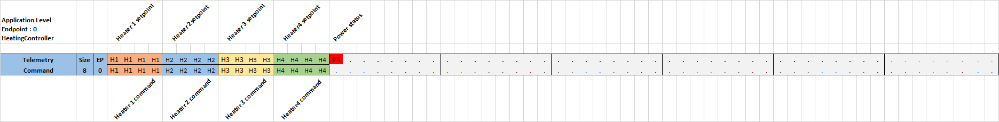

# Heaters controller

Based on BSP Tiny rev A board.

## CANIOT

### Identification
- Class: 1
- Device ID: 1
- Name: HeatingController
- Magic: `0x523a5a5b`

### Endpoints

- Application Level Control (0)
- Board Level Control (3)

### Application Level Control (0)

## BSP Bindings

## Controllable pins

| Pin Index | Name | Description       | Binding                  |
| --------- | ---- | ----------------- | ------------------------ |
| 0         | PC0  | MCU GPIO          | -                        |
| 1         | PC1  | MCU GPIO          | -                        |
| 2         | PC2  | MCU GPIO          | Grid Power Presence (in) |
| 3         | PC3  | MCU GPIO          | -                        |
| 4         | PD4  | MCU GPIO          | -                        |
| 5         | PD5  | MCU GPIO          | -                        |
| 6         | PD6  | MCU GPIO          | -                        |
| 7         | PD7  | MCU GPIO          | -                        |
| 8         | EIO0 | EXTERNAL PCF GPIO | Heater 4 Neg OC (out 4L) |
| 9         | EIO1 | EXTERNAL PCF GPIO | Heater 4 Pos OC (out 4H) |
| 10        | EIO2 | EXTERNAL PCF GPIO | Heater 3 Neg OC (out 3L) |
| 11        | EIO3 | EXTERNAL PCF GPIO | Heater 3 Pos OC (out 3H) |
| 12        | EIO4 | EXTERNAL PCF GPIO | Heater 2 Neg OC (out 2L) |
| 13        | EIO5 | EXTERNAL PCF GPIO | Heater 2 Pos OC (out 2H) |
| 14        | EIO6 | EXTERNAL PCF GPIO | Heater 1 Neg OC (out 1L) |
| 15        | EIO7 | EXTERNAL PCF GPIO | Heater 1 Pos OC (out 1H) |
| 16        | PB0  | MCU GPIO          | -                        |
| 17        | PE0  | MCU GPIO          | -                        |
| 18        | PE1  | MCU GPIO          | -                        |