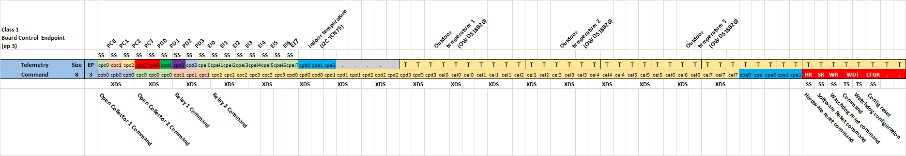
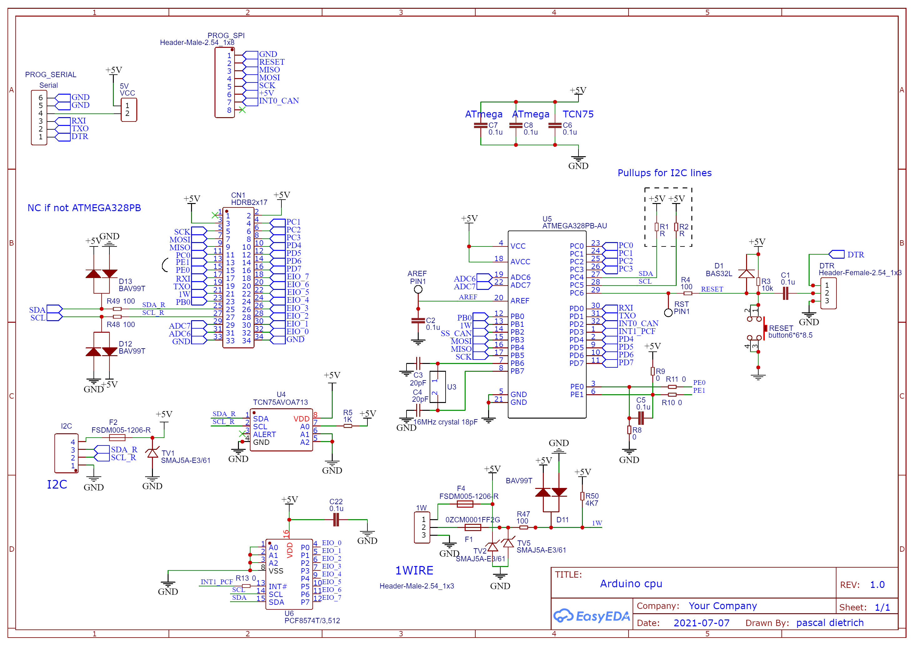
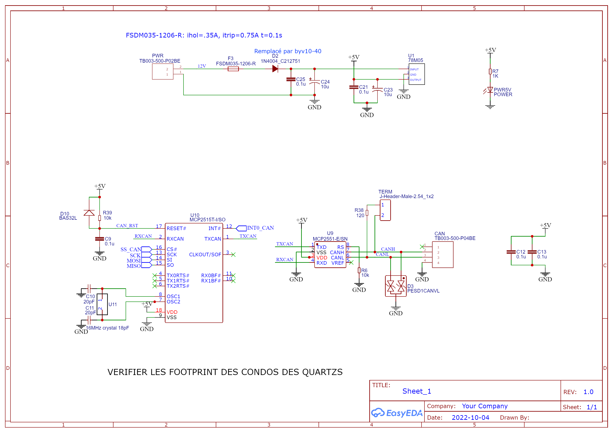
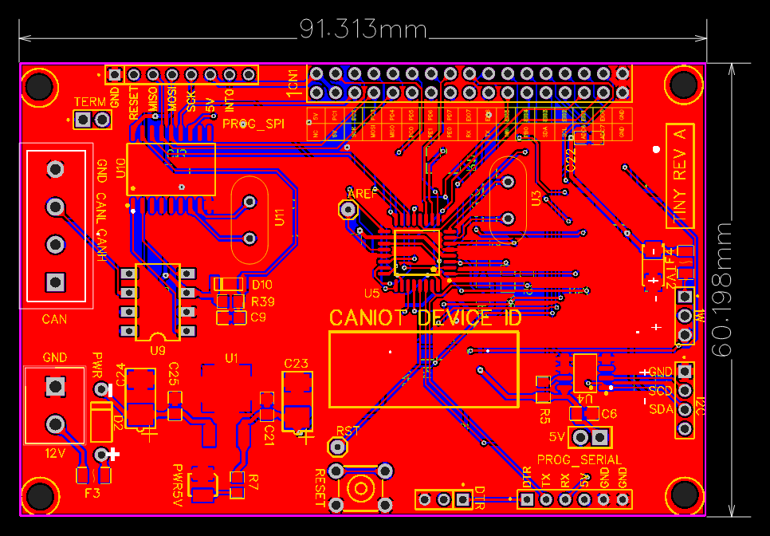
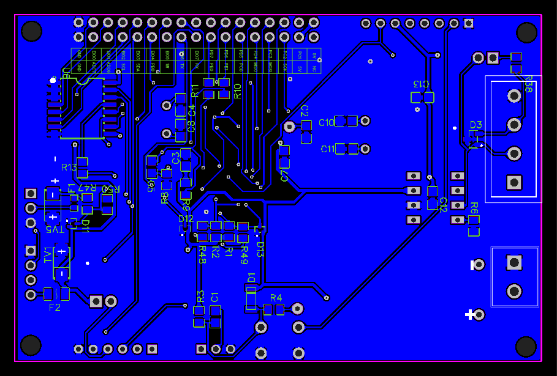

# BSP Tiny - Caniot Class 1

## Features

- CANIOT Class: `1`, including:
    -  9 (if *ATmega328P*) or 11 (if *ATmega328PB*) MCU GPIOs (in/out)
    -  8 PCF8574 GPIOs (in/out)
- Devices/Drivers support:
    - Watchdog
    - TCN75(A)
    - DS18S20
    - PCF8574(A)
    - MCP2515
    - GPIO Pulse
    - Heaters
    - Shutters
    - MCP3008
    - OW DS18S20/DS18B20 support
- UART configuration
    - 500000 baud
    - 8 data bits
    - 1 stop bit
    - no parity

## Caniot Class 1 Board Level Control Endpoint (3)

### Controllable pins

| Pin Index | Name | Description                                     |
| --------- | ---- | ----------------------------------------------- |
| 0         | PC0  | MCU GPIO          (in/out)                      |
| 1         | PC1  | MCU GPIO          (in/out)                      |
| 2         | PC2  | MCU GPIO          (in/out)                      |
| 3         | PC3  | MCU GPIO          (in/out)                      |
| 4         | PD4  | MCU GPIO          (in/out)                      |
| 5         | PD5  | MCU GPIO          (in/out)                      |
| 6         | PD6  | MCU GPIO          (in/out)                      |
| 7         | PD7  | MCU GPIO          (in/out)                      |
| 8         | EIO0 | EXTERNAL PCF GPIO (in/out)                      |
| 9         | EIO1 | EXTERNAL PCF GPIO (in/out)                      |
| 10        | EIO2 | EXTERNAL PCF GPIO (in/out)                      |
| 11        | EIO3 | EXTERNAL PCF GPIO (in/out)                      |
| 12        | EIO4 | EXTERNAL PCF GPIO (in/out)                      |
| 13        | EIO5 | EXTERNAL PCF GPIO (in/out)                      |
| 14        | EIO6 | EXTERNAL PCF GPIO (in/out)                      |
| 15        | EIO7 | EXTERNAL PCF GPIO (in/out)                      |
| 16        | PB0  | MCU GPIO          (in/out)                      |
| 17        | PE0  | MCU GPIO          (in/out) (*ATmega328PB* only) |
| 18        | PE1  | MCU GPIO          (in/out) (*ATmega328PB* only) |

## rev A

The schematic is freely available here: [tiny_rev_A_schematic.pdf](res/tiny_rev_A_schematic.pdf).
If you are interested in the board, feel free to contact me. EasyEDA was used as CAD tool.

