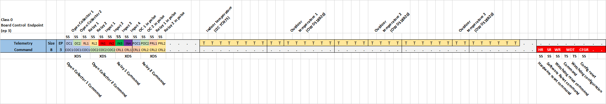

# BSP - V1

## Features

- CANIOT Class: 1
- Controllable pins:
  - 2 relays
  - 2 open collector outputs
  - 4 inputs
- Devices/Drivers support:
  - TCN75
  - DS18S20
  - MCP2515
- UART configuration
  - 115200 baud
  - 8 data bits
  - 1 stop bit
  - no parity

## Caniot Class 0 Board Level Control Endpoint (3)

## Controllable pins

| Pin Index | Name | Description         |
| --------- | ---- | ------------------- |
| 0         | OC1  | Open Collector 1 (out) |
| 1         | OC2  | Open Collector 2 (out) |
| 2         | RL1  | Relay 1       (out) |
| 3         | RL2  | Relay 2       (out) |
| 4         | IN1  | Input 1       (in)  |
| 5         | IN2  | Input 2       (in)  |
| 6         | IN3  | Input 3       (in)  |
| 7         | IN4  | Input 4       (in)  |