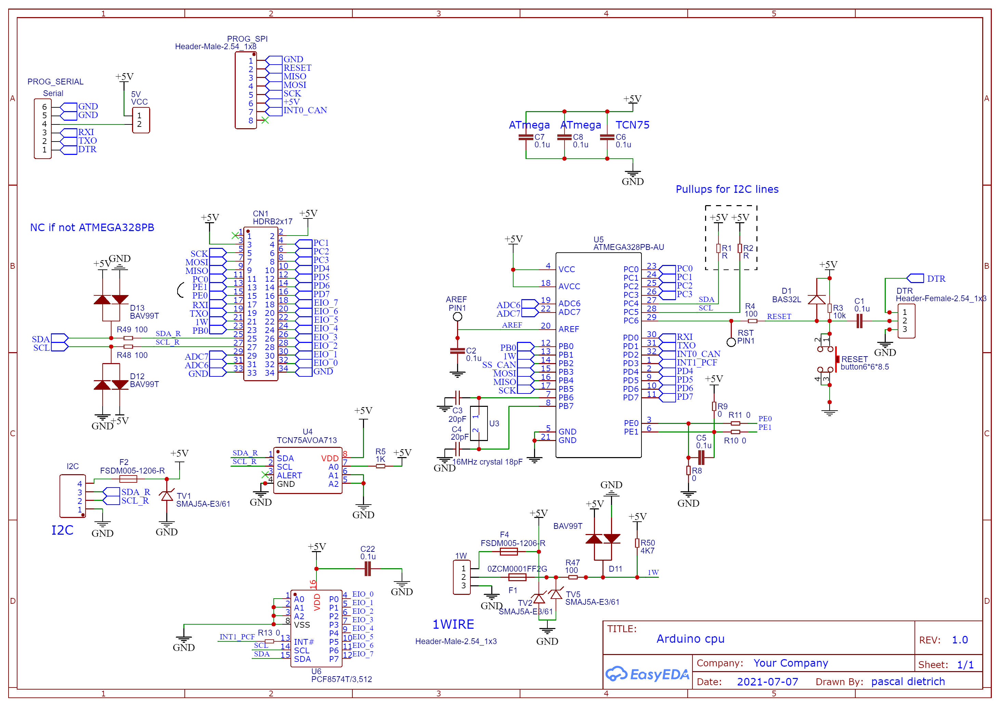
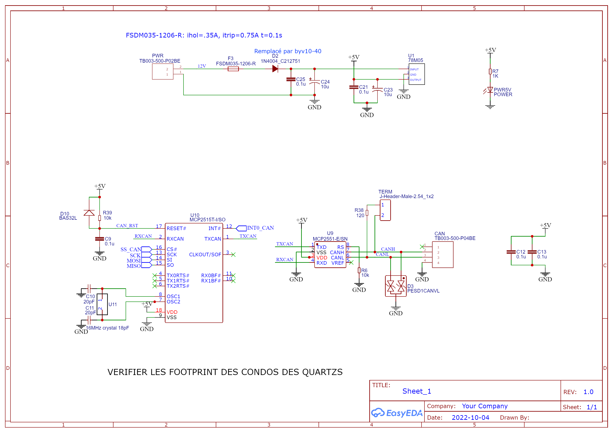
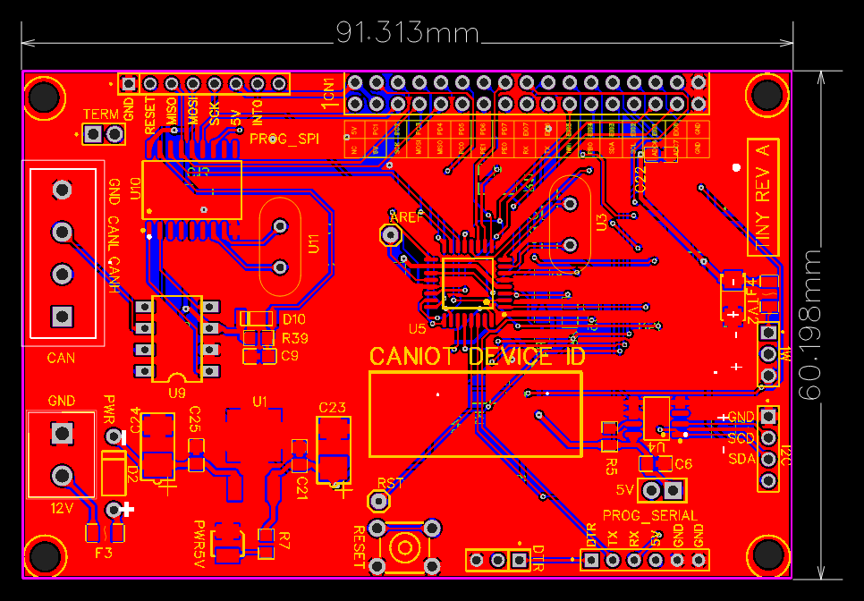
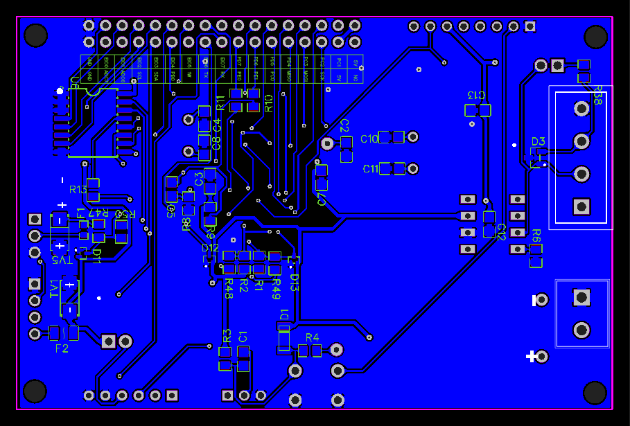

# CAN-IoT device (v2)

**Disclaimer: This is a still work in progress personal project. I'm having fun
reinventing the wheel.**

This repository contains the for firmware for the CAN IoT device boards based on
the AVR ATmega328P (B) MCU.

It implements the custom CANIOT protocol, which is a simple protocol base on
CAN. It enables a Gateway to received telemetry from the device, send generic 
commands and make essential configuration. Full implementation and documentation of the protocol is available at 
[caniot-lib](git@github.com:lucasdietrich/caniot-lib.git).

This firmware also runs a custom RTOS, which provides simple features like 
cooperative multitasking, synchronization primitives, workqueues, low-level
drivers and more. Full implementation and documentation of the RTOS is available at
[AVRTOS](https://github.com/lucasdietrich/AVRTOS).

This firmware does not implement any specific device logic, but allow
a gateway to control several types of devices, such as garage door, shutters,
heaters and more through the CANIOT protocol.

## Boards

Following boards are supported:

| Board                                                    | MCU           | Controllable pins | Devices/Drivers support           | CANIOT Class |
| -------------------------------------------------------- | ------------- | ----------------- | --------------------------------- | ------------ |
| V1                                                       | ATmega328P(B) | 8                 | TCN75<br>DS18S20                  | CLASS0       |
| Tiny rev A - [schematic](./res/tiny_rev_A_schematic.pdf) | ATmega328P(B) | 19                | TCN75(A)<br>DS18S20<br>PCF8574(A) | CLASS1       |
| Tiny rev B                                               | ATmega328P(B) | 19                | TCN75(A)<br>DS18S20<br>PCF8574(A) | CLASS1       |


## Tiny

Most important part of the work related to schematic, PCB drawing and board 
assembly was made by my father.

The schematic is freely available here: [tiny_rev_A_schematic.pdf](./res/tiny_rev_A_schematic.pdf).
If you are interested in the board, feel free to contact me. EasyEDA was used as CAD tool.







## V1

- Documentation TODO

## All features

- Boards
  - v1
  - Tiny
- MCU Support
  - ATmega328P
  - ATmega328PB
- Communication
  - CAN
  - CANIOT protocol
- Device support
  - TCN75 (A) (I2C)
  - DS18S20 (one wire)
  - PCF8574 (A) (I2C)
- More high-level features
  - GPIO Pulse support
  - Heaters
  - Shutters

## Project structure

```
├── docs : documentation
├── include
├── lib : external libraries
│   ├── AVRTOS : Custom RTOS for AVR MCUs
│   ├── caniot-lib : Custom CAN application protocol
├── pics
├── res : Ressources (board schematics, ...)
├── platformio.ini : PlatformIO configuration
├── readme.md : This file
├── scripts
└── src : Source code
    ├── bsp : Board support package for supported boards (v1, tiny, ...)
    ├── class : Code specific to a specific CANIOT class (see CANIOT protocol documentation)
    ├── devices : Drivers for supported devices (TCN75, DS18S20, heater, shutter, ...)
    ├── nodes : Specific code to achieve device role (garage door, heater, ...)
``` 

## Build the firmware

PlatformIO for VSCode is required to build the firmware. Then simply select the
application you want to build and press the build button.

## Bootloader

[Minicore bootloader](https://github.com/MCUdude/MiniCore) is required.

## Flash the firmware

Flash with PlatformIO or avrdude.

## Monitor

With pyserial miniterm: `python3 -m serial.tools.miniterm /dev/ttyACM0 500000`.
Exit with `Ctrl + T` then `Q`

Or screen: `screen /dev/ttyACM0 500000`.
Exit screen with shortcuts : `Ctrl + A` and `Ctrl + \` meaning (AltGr + 8), then `y`.

---

## Devices

- Garage Door Controller
- Alarm Controller
- Heating Controller	
- Shutters Controller

## Expected result with Alarm Controller (outdated) 

Logs
```
ROM = 28 bc 49 9c 32 20 1 83: DS18B20
===== k_thread =====
C 0x045C READY   C ____ : SP 21/110:0x016D
A 0x0470 READY   C ____ : SP 21/160:0x020D
W 0x0484 READY   C ____ : SP 21/128:0x02D1
M 0x0498 READY   C ____ : SP 0/250:0x06D4
I 0x04AC READY   P ____ : SP 21/59:0x0248
name    = AlarmController
cls/dev = 0/3
version = c8

00:00:00 [0.026 s] : [ c5 ] Telemetry Response [24] 0x18 (cls=C0 sid=D3) : ep-0 / 00 00 f4 01 00 00 46 00 
[C] CANARIES until @0133 [found 50], MAX usage = 59 / 109 + 1 (sentinel) 
[A] CANARIES until @01EE [found 127], MAX usage = 32 / 159 + 1 (sentinel)
[W] CANARIES until @0293 [found 64], MAX usage = 63 / 127 + 1 (sentinel)
[M] CANARIES until @0620 [found 68], MAX usage = 181 / 249 + 1 (sentinel)
[I] CANARIES until @0220 [found 17], MAX usage = 41 / 58 + 1 (sentinel)
00:00:16 [16.450 s] : [ c0 ] Command Query [24] 0x18 (cls=C0 sid=D3) : ep-0 / 00 10 00 00 00 00 00 00
00:00:16 [16.452 s] : alarm: inactive -> observing
00:00:16 [16.454 s] : [ c5 ] Telemetry Response [24] 0x18 (cls=C0 sid=D3) : ep-0 / 04 00 f4 01 00 00 7d 00
00:00:21 [21.571 s] : [ c0 ] Command Query [24] 0x18 (cls=C0 sid=D3) : ep-0 / 00 01 00 00 00 00 00 00
00:00:21 [21.574 s] : [ c5 ] Telemetry Response [24] 0x18 (cls=C0 sid=D3) : ep-0 / 05 00 f4 01 00 00 7d 00
00:00:22 [22.430 s] : [ c0 ] Command Query [24] 0x18 (cls=C0 sid=D3) : ep-0 / 00 04 00 00 00 00 00 00
00:00:22 [22.439 s] : [ c5 ] Telemetry Response [24] 0x18 (cls=C0 sid=D3) : ep-0 / 07 00 f4 01 00 00 7d 00
00:00:25 [25.043 s] : [ c0 ] Command Query [24] 0x18 (cls=C0 sid=D3) : ep-0 / 00 00 00 00 00 00 00 00
00:00:25 [25.046 s] : [ c5 ] Telemetry Response [24] 0x18 (cls=C0 sid=D3) : ep-0 / 07 00 f4 01 00 00 7d 00
00:00:26 [26.184 s] : [ c0 ] Command Query [24] 0x18 (cls=C0 sid=D3) : ep-0 / 00 00 00 00 00 00 00 00
00:00:26 [26.187 s] : [ c5 ] Telemetry Response [24] 0x18 (cls=C0 sid=D3) : ep-0 / 07 00 f4 01 00 00 7d 00
00:00:27 [27.013 s] : [ c0 ] Command Query [24] 0x18 (cls=C0 sid=D3) : ep-0 / 00 00 00 00 00 00 00 00
00:00:27 [27.016 s] : [ c5 ] Telemetry Response [24] 0x18 (cls=C0 sid=D3) : ep-0 / 07 00 f4 01 00 00 7d 00
00:00:28 [28.133 s] : [ c0 ] Command Query [24] 0x18 (cls=C0 sid=D3) : ep-0 / 00 00 00 00 00 00 00 00
00:00:28 [28.136 s] : [ c5 ] Telemetry Response [24] 0x18 (cls=C0 sid=D3) : ep-0 / 07 00 f4 01 00 00 7d 00
[C] CANARIES until @0132 [found 49], MAX usage = 60 / 109 + 1 (sentinel)
[A] CANARIES until @0194 [found 37], MAX usage = 122 / 159 + 1 (sentinel)
[W] CANARIES until @0293 [found 64], MAX usage = 63 / 127 + 1 (sentinel)
[M] CANARIES until @061D [found 65], MAX usage = 184 / 249 + 1 (sentinel)
[I] CANARIES until @0220 [found 17], MAX usage = 41 / 58 + 1 (sentinel)
```

## Ressources (to cleanup)

- https://docs.arduino.cc/built-in-examples/arduino-isp/ArduinoISP
- https://arduino.stackexchange.com/questions/36071/how-does-avrdude-burn-a-bootloader-much-quicker-than-the-arduino-ide
- https://www.avrfreaks.net/forum/cannot-connect-avrdude-mega2560
- https://github.com/MCUdude/MiniCore
- https://github.com/MCUdude/MiniCore/blob/master/PlatformIO.md
- https://github.com/MCUdude/MiniCore/tree/master/avr/bootloaders/optiboot_flash/bootloaders/atmega328pb/16000000L
- https://community.platformio.org/t/upload-and-debug-for-atmega328p-with-atmel-ice/18796
- https://community.platformio.org/t/burn-bootloader-for-a-custom-atmega328p-board/22587
- https://community.platformio.org/t/minicore-atmega328p/9042
- https://docs.platformio.org/en/latest/frameworks/arduino.html#minicore-mightycore-megacore
- https://www.avrfreaks.net/forum/watchdog-reset-or-any-other-software-reset
- https://www.avrfreaks.net/forum/software-reset-6
- https://www.avrfreaks.net/forum/how-use-avr-watchdog
- https://www.avrfreaks.net/comment/178013#comment-178013